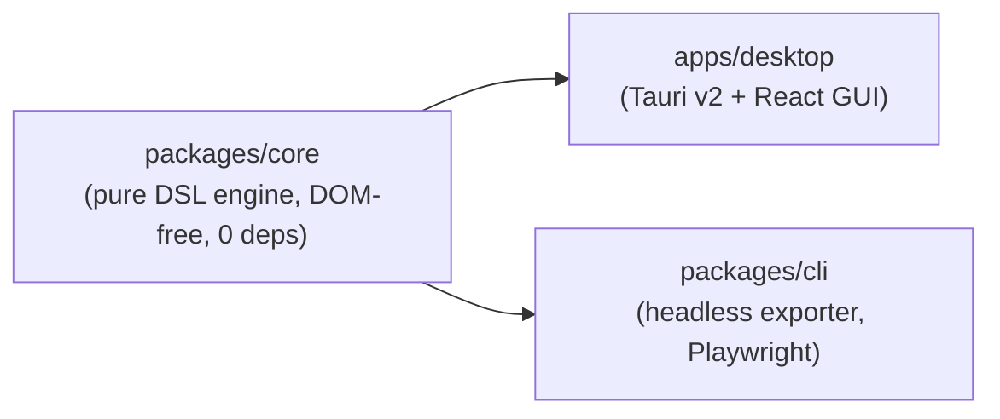
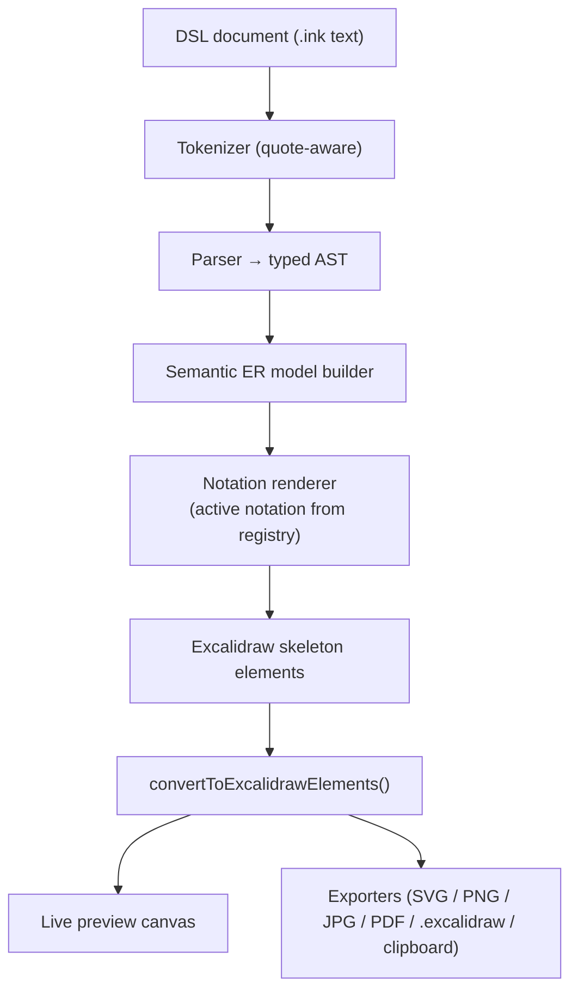

# Inkling — Design & Architecture Specification

This document describes what Inkling is, how it is built, and where its extension points are. For the end-user language reference, see [docs/DSL.md](docs/DSL.md); for build and run instructions, see [README.md](README.md).

---

## 1. Goals

- **Text as the single source of truth.** The diagram is a pure, deterministic function of the DSL document. There is no hidden canvas state to drift out of sync.
- **One model, many notations.** A single semantic ER model renders in five notations — **Chen** (default), **Crow's Foot / IE**, **UML class-style**, **IDEF1X**, and **Min-Max (ISO `(min,max)`)** — switchable live without editing the text.
- **What you see is what you export.** The live preview and every exporter consume the *same* Excalidraw elements, so exports never surprise you.
- **A pleasant, native, cross-platform app.** macOS, Windows, and Linux, with platform-appropriate window effects and a distinct visual identity.
- **Extensible by construction.** Adding a notation, an export format, or a DSL node kind should be a one-file change against a registry.
- **A pure, testable core.** All language and rendering logic lives in a DOM-free package with zero runtime dependencies and thorough unit tests.

## 2. Non-goals

- **Not a free-form drawing tool.** Direct manipulation of the canvas is intentionally minimal; primitives exist as an escape hatch, not as the primary workflow.
- **Not a database / schema tool.** Inkling models *conceptual* ER diagrams; it does not generate DDL, connect to databases, or reverse-engineer schemas.
- **Not collaborative/real-time.** No multi-user editing, accounts, or cloud sync in scope.
- **Not a general Excalidraw editor.** Excalidraw is the renderer and exporter, not a user-facing scene editor.

---

## 3. Monorepo architecture

Inkling is a pnpm workspace with three packages and a clean dependency direction: everything flows **out of** `core`.



| Package | Responsibility | Notable constraints |
| --- | --- | --- |
| `packages/core` | Tokenize → parse → build semantic model → render to notation → emit Excalidraw skeleton elements. | Pure, DOM-free, **zero runtime dependencies**. Unit-tested with Vitest. |
| `apps/desktop` | Editor (CodeMirror 6), live preview (@excalidraw/excalidraw), export UI, theming, window effects. | Tauri v2 + Vite + React + TypeScript. |
| `packages/cli` | `inkling diagram.ink -o out.png …` — reuses `core`, renders via headless Excalidraw driven by Playwright. | Headless; no GUI. |

**Toolchain.** Node pinned to 22 (`.nvmrc`), `engines.node >=20`; pnpm `>=9` (repo uses `pnpm@11.13.1`); Rust stable for Tauri.

---

## 4. Data flow

The same compiled elements feed the live preview and every export path. This is what guarantees WYSIWYG export.



---

## 5. The core pipeline in detail

### 5.1 Tokenizer

A quote-aware lexer. It splits each line into tokens while treating double-quoted spans as single string tokens, so labels may contain spaces. It recognizes `#` comments (whole-line and trailing), skips blank lines, and preserves source positions for error reporting.

### 5.2 Parser → typed AST

Each line's leading keyword selects a statement parser (see the **shape/node registry**, §6.3). The parser produces a **typed AST** node per statement and validates as it goes. Reported errors include:

- **Unknown command** — unrecognized leading keyword.
- **Duplicate id** — an id declared more than once.
- **Malformed coordinate / cardinality** — bad `@x,y` or an unrecognized cardinality token.
- **Reference to unknown id** — an edge/attribute references an undeclared id.

Keywords match case-insensitively; ids are compared case-sensitively.

### 5.3 Semantic model builder

The AST is folded into a **semantic ER model** — a notation-independent graph of entities (strong/weak), relationships (with `identifying` flags and participation links carrying cardinality/role/total flags), and attributes (with `key`/`partial`/`derived`/`multi`/`optional` flags). Primitive statements are carried through as free-form nodes. This model is the pivot: it is what every notation renderer consumes.

### 5.4 Notation renderer

The renderer selected from the **notation-renderer registry** (§6.2) walks the semantic model and emits **Excalidraw skeleton elements** for that notation. Renderers share layout helpers (driven by the `direction` hint) but own their shape vocabulary and cardinality presentation (see §7).

### 5.5 Skeleton → Excalidraw elements

Skeleton emission handles the fiddly details so both preview and export are correct:

- **Bound-text labels** attached to shapes.
- **Arrows with real start/end bindings** to shape ids (not free-floating coordinates).
- **Inset outlines** to draw double borders (weak entity, identifying relationship, multivalued attribute, total participation).
- **Border-intersection endpoints** so connectors meet shape borders cleanly; users never place endpoints.

The skeleton is passed to Excalidraw's `convertToExcalidrawElements`, and the resulting elements are shared by the preview and every exporter.

---

## 6. Extension points: the three registries

Extensibility is deliberate and uniform. Each registry is a small `register(key, impl)` map; adding a capability is a one-file change plus a registration call.

### 6.1 Exporter registry

```
register(format, fn)   // e.g. register("svg", svgExporter)
```

Maps an export format id to a function that turns the shared Excalidraw elements (plus theme/background options) into bytes. Formats: `.excalidraw`, `svg`, `png`, `jpg`, `pdf`, `clipboard`. Adding a format is one file + one `register` call; nothing upstream changes.

### 6.2 Notation-renderer registry

```
register(notation, renderer)   // e.g. register("chen", chenRenderer)
```

Maps a notation id to a renderer that turns the semantic model into skeleton elements. The five built-ins register here; the notation picker simply selects the active key. A sixth notation is a new file + one `register` call.

### 6.3 Shape / node registry (compiler)

Maps a DSL statement keyword to its parser + AST node kind + model contribution. Adding a new node kind (a new statement) is a new file + one `register` call; the tokenizer and downstream stages need no changes.

---

## 7. The semantic model and the five notations

The semantic model is notation-agnostic. Each notation renderer projects it differently. The core mappings:

| Model element | Chen | Crow's Foot / IE | UML | IDEF1X | Min-Max |
| --- | --- | --- | --- | --- | --- |
| Entity | Rectangle | Box | Class box | Box (rounded if dependent) | Box |
| Weak entity | Double rectangle | Box (marked) | Class box | Rounded/identified box | Box |
| Relationship | Diamond | Edge between boxes | Association | Relationship line | Edge |
| Identifying relationship | Double diamond | — | — | Solid line | — |
| Attribute | Ellipse (key underlined; derived dashed; multivalued double) | Row in box | Class member | Key/non-key compartment | Row in box |
| Cardinality | Connector label (`1`/`N`) | Crow's-foot symbols | Multiplicity label | Line style + markers | `(min,max)` pair |
| Total participation | Double line | Mandatory bar | `1..*` multiplicity | Line style | `min ≥ 1` |

**Cardinality tokens.** `1` = `(1,1)`; `N`/`M`/`*` = `(1,N)`; explicit ranges `0..1`, `1..1`, `0..*`, `1..*` for precise optionality. See [docs/DSL.md](docs/DSL.md#cardinality-tokens) for the per-notation rendering rules in full.

---

## 8. Shared skeleton → preview/export path

Because §5.5's elements are produced once and shared, the preview canvas and all six exporters render from identical data. Consequences:

- **Fidelity.** Export can never diverge from what's on screen.
- **Testability.** `core` can assert on skeleton/element structure without a DOM.
- **Uniformity.** New exporters get correct bindings, double borders, and label placement for free.

---

## 9. Theming & token architecture

**Identity.** A precise monospace "ink" editor beside a warm hand-drawn "paper" canvas, viewed through frosted translucent window chrome. A single accent — fountain-pen peacock ink: `#0E7C86` (light) / `#3FB6C4` (dark).

- **Design tokens.** Colors, spacing, radii, and typography are expressed as tokens with light/dark values; components read tokens, never raw hex. Themes follow system appearance with a manual override.
- **Typography (self-contained via `@fontsource`).** Bricolage Grotesque (display), IBM Plex Sans (UI), IBM Plex Mono (editor), Excalifont (canvas, owned by Excalidraw). No network fonts.
- **Export theming is independent.** Exports carry their own light/dark and background settings via Excalidraw's `exportWithDarkMode` / `theme`, `viewBackgroundColor` / `exportBackground`, plus a transparent-background toggle. A dark editor can emit a light PNG and vice-versa.
- **Accessibility floor.** Contrast ≥ 4.5:1, visible focus rings, honors `prefers-reduced-motion`, and lint errors are conveyed by gutter marker + squiggle + message, never color alone.

---

## 10. Persistence

The desktop app persists a small amount of local state between sessions:

- **Last document** — the current `.ink` text is restored on launch (the construction-safety sample loads on first run).
- **Window geometry** — size and position.
- **Theme** — the light/dark choice or system-follow setting.

Persistence is local to the machine; there are no accounts or cloud storage.

---

## 11. Cross-platform window effects

Inkling requests platform-native translucency where available and degrades gracefully where not:

| Platform | Effect | Fallback |
| --- | --- | --- |
| macOS | Vibrancy (frosted translucency behind chrome). | Solid theme background. |
| Windows | Mica / Acrylic. | Solid theme background. |
| Linux | Opaque theme background. | — (opaque is the baseline). |

The app never *requires* an effect to be usable: if a compositor or platform can't provide translucency, the same layout renders on a solid, fully themed background with identical functionality.
